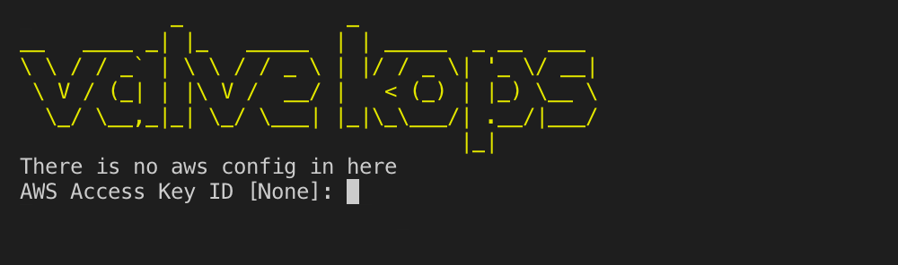
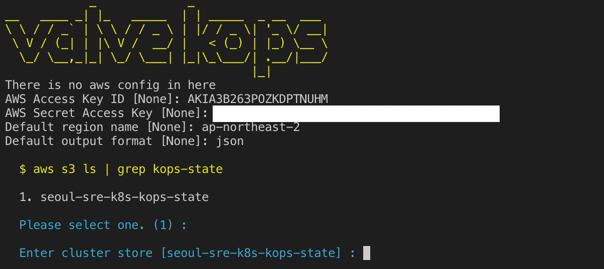

# valve-kops
kops 명령을 사용해서 쿠버네티스 클러스터 설치를 돕는 CUI 도구 입니다.

해당 프로젝트는 [kops-cui](https://github.com/opsnow/kops-cui)의 kops 설치 구현 부분을 분리해서 진행하는 프로젝트입니다. 

* Support Cloud
  * AWS
* Support OS
  * MacOS
  * Linux (centos, ubuntu ...)

## 기능
* kops를 통한 쿠버네티스 설치
* kops 클러스터 운영
  * Get Cluster
    * 클러스터의 상태를 확인할 수 있습니다.
  * Edit Cluster
    * 클러스터의 설정을 변경할 수 있습니다.
  * Update Cluster
    * 클러스터의 설정을 업데이트 할 수 있습니다.
    * 노드에 설정이 반영이 필요한 경우 `Rolling Update`를 실행해야 합니다.
  * Rolling Update
    * 클러스터의 설정을 노드에 반영할 할 수 있습니다.
  * Validate Cluster
    * 클러스터의 유효성을 확인할 수 있습니다.
  * Export Kube Config
    * 클러스터 접속 정보를 kube config에 업데이트 합니다.
  * Change SSH key

## 사전 준비 사항
* AWS CLI
* AWS 접속을 위한 엑세스 키, 시크릿 키
* VPC
  * k8s 클러스터가 구성될 환경
* S3 bucket
  * kops state 파일 저장소

## 사용 방법

### 설치
```bash
$ git clone https://github.com/opsnow-tools/valve-kops
$ ./run.sh
```

### 도구 설치
kops 구동에 필요한 CLI 도구를 설치합니다.
* valve-kops 실행 > `t` update tools 실행

다음과 같은 도구가 설치됩니다.
* kubectl
* kops
* helm
* draft
* guard

### 초기 환경 설정

#### AWS Access Key
valve-kops 를 실행하기 위해서는 AWS 접속을 위한 엑세스 키, 시크릿 키 등을 설정해야 합니다.
해당 값이 설정되어 있지 않다면 최초 실행시 설정할 수 있는 프롬프트가 생성됩니다.


#### S3 state 저장소 위치 선택
kops state를 저장할 S3 버킷명을 선택합니다. 선택할 S3 버킷명의 번호를 입력하고 엔터키를 누릅니다.
선택할 S3 저장소가 리스트에 없으면 값을 입력하지 않고 엔터키를 누르면 저장소를 직접 입력할 수 있는 프롬프트가 생성됩니다.


#### 클러스터 식별자 선택
클러스터 식별자를 선택합니다. `dev`, `demo`, `sample`, `stage`, `prod` 중에 한 개를 선택하여 해당 번호를 입력하고 엔터키를 누릅니다. 기존에 생성된 클러스터가 있다면 해당 클러스터 목록을 선택할 수 있습니다.
클러스터 식별자를 직접 입력하고 싶다면 값을 입력하지 않고 엔터키를 누르면 클러스터 식별자를 직접 입력할 수 있는 프롬프트가 생성됩니다.

### 클러스터 설정 생성
클러스터 설정 생성은 다음 화면에서 실행할 수 있습니다.
```
valve-kops

  seoul-sre-k8s-kops-state > yyy

  1. Create Cluster

  u. update self
  t. update tools

  x. Exit

  Enter your choice : 
```
`1. Create Cluster`를 선택하면 클러스터 생성을 위한 설정값을 조정할 수 있는 화면이 출력됩니다.

키 | 기본값 | 수정 가능 여부 | 설명
-- | ----- | ---------- | ---
cloud | aws | 불가 | 클러스터 설치 클라우드 서비스 프로바이더
name | <클러스터 식별자>.k8s.local | 불가 | 클러스터 명
state | <state 저장 경로> | 불가 | kops state 파일 저장을 위한 s3 버킷 경로, 예) s3://seoul-sre-k8s-kops-state
master-size | c4.large | 가능 | 마스터 노드 인스턴스 타입
master-count | 1 | 가능 | 마스터 노드 개수
master-zones | <AWS config의 AZ 코드> | 불가 | 마스터 노드 생성 가용 영역
node-size | m4.large | 가능 | 워커 노드 인스턴스 타입
node-count | 2 | 가능 | 워커 노드 개수
node-zones | <AWS config의 AZ 코드> | 불가 | 워커 노드 생성 가용 영역
network-cidr | 10.0.0.0/16 | 가능 | 클러스터가 사용한 IP 대역, CIDR 표기
networking | calico | 가능 | CNI 프로바이더, calico, canal, flannel, ... https://github.com/kubernetes/kops/blob/master/docs/networking.md
topology | public | 가능 | 클러스터 토폴로지 선택, private, public
dns-zone | | 가능 | (선택) Route53 hosted zone, 서브 도메인 입력 가능
vpc | | 가능 | (선택) 클러스터가 생성될 VPC ID, 입력하지 않으면 새로운 VPC를 생성함

설정값은 `kops create` 명령을 수행하기 위한 파라미터로 사용됩니다. 
자세한 속성값의 의미는 kops CLI 사용법을 확인하시기 바랍니다.
* https://github.com/kubernetes/kops/blob/master/docs/cli/kops_create_cluster.md

클러스터 설정값을 입력한 후 `c. create` 를 선택하면 kops 명령을 통해 클러스터를 생성하겠다는 선택지 입니다. `t. terraform` 을 선택하면 terraform 명령을 통해 클러스터를 생성하겠다는 선택지 입니다.

`t. terraform` 을 선택하면 terraform 스크립트가 생성되고 이후의 작업은 terraform 스크립트를 통해 진행해야 합니다. 즉, 클러스터 리소스 제어가 terraform 코드를 통해서 진행되므로 이 후 valve-kops를 통해서 진행되는 작업은 무의미 합니다.

`c. create` 를 선택하였다면 kops 실행을 위한 코드가 생성됩니다. 즉시 실행 옵션 `--yes` 없이 실행되기 때문에 아직 리소스가 생성되지 않습니다. 

이제 클러스터 생성을 위한 설정 파일이 생성되었고 세부 항목을 설정할 수 있습니다.

### 클러스터 설정 변경

클러스터 설정을 생성하면 다음 화면에서 작업을 진행할 수 있습니다.
```
  valve-kops

  seoul-sre-k8s-kops-state > dev.k8s.local

  1. Get Cluster
  2. Edit Cluster
  3. Update Cluster
  4. Rolling Update
  5. Validate Cluster
  6. Export Kube Config
  7. Change SSH key

  9. Delete Cluster

  u. update self
  t. update tools

  x. Exit

  Enter your choice : 
```

클러스터 설정 변경은 `2. Edit Cluster`으로 진행합니다.
```
1. master-ap-northeast-2a
2. nodes

0. cluster

Enter your choice :
```
클러스터(0. cluster), 마스터 노드(1. master-ap-northeast-2a), 워커 노드(2. nodes)의 설정을 변경할 수 있습니다.

#### 클러스터 수준 설정 변경

클러스터 설정값은 다음과 같습니다. 
각 설정값은 다음 문서를 참고하여 수정할 수 있습니다.
* https://github.com/kubernetes/kops/blob/master/docs/cluster_spec.md
```yaml
# Please edit the object below. Lines beginning with a '#' will be ignored,
# and an empty file will abort the edit. If an error occurs while saving this file will be
# reopened with the relevant failures.
#
apiVersion: kops/v1alpha2
kind: Cluster
metadata:
  creationTimestamp: 2019-07-25T11:02:51Z
  name: dev.k8s.local
spec:
  api:
    loadBalancer:
      type: Public
  authorization:
    rbac: {}
  channel: stable
  cloudProvider: aws
  configBase: s3://seoul-sre-k8s-kops-state/dev.k8s.local
  etcdClusters:
  - cpuRequest: 200m
    etcdMembers:
    - instanceGroup: master-ap-northeast-2a
      name: a
    memoryRequest: 100Mi
    name: main
    version: 3.2.24
  - cpuRequest: 100m
    etcdMembers:
    - instanceGroup: master-ap-northeast-2a
      name: a
    memoryRequest: 100Mi
    name: events
    version: 3.2.24
  iam:
    allowContainerRegistry: true
    legacy: false
  kubelet:
    anonymousAuth: false
  kubernetesApiAccess:
  - 0.0.0.0/0
  kubernetesVersion: 1.12.8
  masterInternalName: api.internal.dev.k8s.local
  masterPublicName: api.dev.k8s.local
  networkCIDR: 10.0.0.0/16
  networking:
    calico:
      majorVersion: v3
  nonMasqueradeCIDR: 100.64.0.0/10
  sshAccess:
  - 0.0.0.0/0
  subnets:
  - cidr: 10.0.32.0/19
    name: ap-northeast-2a
    type: Public
    zone: ap-northeast-2a
  - cidr: 10.0.64.0/19
    name: ap-northeast-2b
    type: Public
    zone: ap-northeast-2b
  - cidr: 10.0.96.0/19
    name: ap-northeast-2c
    type: Public
    zone: ap-northeast-2c
  topology:
    dns:
      type: Public
    masters: public
    nodes: public
```
#### 마스터 노드 설정 변경
마스터 노드 설정값은 다음과 같습니다. 
각 설정값은 다음 문서를 참고하여 수정할 수 있습니다.
* https://github.com/kubernetes/kops/blob/master/docs/instance_groups.md

예제)
```yaml
apiVersion: kops/v1alpha2
kind: InstanceGroup
metadata:
  creationTimestamp: 2019-07-25T11:02:51Z
  labels:
    kops.k8s.io/cluster: dev.k8s.local
  name: master-ap-northeast-2a
spec:
  image: kope.io/k8s-1.12-debian-stretch-amd64-hvm-ebs-2019-05-13
  machineType: c4.large
  maxSize: 1
  minSize: 1
  nodeLabels:
    kops.k8s.io/instancegroup: master-ap-northeast-2a
  role: Master
  subnets:
  - ap-northeast-2a
```

#### 워커 노드 설정 변경
워커 노드 설정값은 다음과 같습니다. 
각 설정값은 다음 문서를 참고하여 수정할 수 있습니다.
* https://github.com/kubernetes/kops/blob/master/docs/instance_groups.md

예제)
```yaml
apiVersion: kops/v1alpha2
kind: InstanceGroup
metadata:
  creationTimestamp: 2019-07-25T11:02:51Z
  labels:
    kops.k8s.io/cluster: dev.k8s.local
  name: nodes
spec:
  image: kope.io/k8s-1.12-debian-stretch-amd64-hvm-ebs-2019-05-13
  machineType: m4.large
  maxSize: 2
  minSize: 2
  nodeLabels:
    kops.k8s.io/instancegroup: nodes
  role: Node
  subnets:
  - ap-northeast-2a
  - ap-northeast-2b
  - ap-northeast-2c
```

### 클러스터 업데이트
클러스터 업데이트는 `3. Update Cluster`으로 진행합니다.
클러스터 리소스가 아직 생성되지 않았기 때문에 클러스터 업데이트 명령은 AWS에 실제 자원을 생성합니다. 

다음 명령을 수행합니다.
```bash
$ kops update cluster --name=dev.k8s.local --state=s3://seoul-sre-k8s-kops-state --yes
```

이제 부터는 `1. Get Cluster`, `5. Validate Cluster` 등을 통해 자원의 생성 상태를 확인할 수 있습니다. 
또 `kubectl` 명령을 수행하기 위해 `6. Export Kube Config` 명령을 사용해 로컬 .kube/config 파일을 수정해 생성한 쿠버네티스를 바라보고 작업할 수 있도록 user context를 변경할 수 있습니다.


### 클러스터 조회
다음은 `1. Get Cluster`를 수행한 결과 입니다.
```bash
$ kops get --name=dev.k8s.local --state=s3://seoul-sre-k8s-kops-state
Cluster
NAME            CLOUD   ZONES
dev.k8s.local   aws     ap-northeast-2a,ap-northeast-2b,ap-northeast-2c

Instance Groups
NAME                    ROLE    MACHINETYPE     MIN     MAX     ZONES
master-ap-northeast-2a  Master  c4.large        1       1       ap-northeast-2a
nodes                   Node    m4.large        2       2       ap-northeast-2a,ap-northeast-2b,ap-northeast-2c

  $ kubectl cluster-info
Kubernetes master is running at https://api-dev-k8s-local-725b01-155249057.ap-northeast-2.elb.amazonaws.com
KubeDNS is running at https://api-dev-k8s-local-725b01-155249057.ap-northeast-2.elb.amazonaws.com/api/v1/namespaces/kube
-system/services/kube-dns:dns/proxy

To further debug and diagnose cluster problems, use 'kubectl cluster-info dump'.

  $ kubectl get node
NAME                                             STATUS     ROLES    AGE   VERSION
ip-10-0-127-13.ap-northeast-2.compute.internal   NotReady   node     1s    v1.12.8
ip-10-0-32-94.ap-northeast-2.compute.internal    Ready      master   49s   v1.12.8
```

### 클러스터 유효성 확인
다음은 `5. Validate Cluster`를 수행한 결과 입니다.
`1. Get Cluster` 과 차이점은 각 노드들의 상태확인이 가능하다는 것입니다.
```bash
$ kops validate cluster --name=dev.k8s.local --state=s3://seoul-sre-k8s-kops-state
Validating cluster dev.k8s.local

INSTANCE GROUPS
NAME                    ROLE    MACHINETYPE     MIN     MAX     SUBNETS
master-ap-northeast-2a  Master  c4.large        1       1       ap-northeast-2a
nodes                   Node    m4.large        2       2       ap-northeast-2a,ap-northeast-2b,ap-northeast-2c

NODE STATUS
NAME                                            ROLE    READY
ip-10-0-127-13.ap-northeast-2.compute.internal  node    True
ip-10-0-32-94.ap-northeast-2.compute.internal   master  True
ip-10-0-60-242.ap-northeast-2.compute.internal  node    True

Your cluster dev.k8s.local is ready

  $ kubectl get node
NAME                                             STATUS   ROLES    AGE     VERSION
ip-10-0-127-13.ap-northeast-2.compute.internal   Ready    node     111s    v1.12.8
ip-10-0-32-94.ap-northeast-2.compute.internal    Ready    master   2m39s   v1.12.8
ip-10-0-60-242.ap-northeast-2.compute.internal   Ready    node     107s    v1.12.8

  $ kubectl get pod -n kube-system
NAME                                                                    READY   STATUS    RESTARTS   AGE
calico-node-lfvj4                                                       1/1     Running   0          2m39s
calico-node-slsn4                                                       1/1     Running   0          107s
calico-node-w6n8m                                                       1/1     Running   0          111s
dns-controller-64b775df4d-lq4dr                                         1/1     Running   0          2m37s
etcd-manager-events-ip-10-0-32-94.ap-northeast-2.compute.internal       1/1     Running   0          115s
etcd-manager-main-ip-10-0-32-94.ap-northeast-2.compute.internal         1/1     Running   0          2m38s
kube-apiserver-ip-10-0-32-94.ap-northeast-2.compute.internal            1/1     Running   3          2m6s
kube-controller-manager-ip-10-0-32-94.ap-northeast-2.compute.internal   1/1     Running   0          71s
kube-dns-57dd96bb49-9pbxg                                               3/3     Running   0          2m41s
kube-dns-57dd96bb49-vw8c6                                               3/3     Running   0          86s
kube-dns-autoscaler-867b9fd49d-fqhhq                                    1/1     Running   0          2m40s
kube-proxy-ip-10-0-127-13.ap-northeast-2.compute.internal               1/1     Running   0          98s
kube-proxy-ip-10-0-32-94.ap-northeast-2.compute.internal                1/1     Running   0          100s
kube-proxy-ip-10-0-60-242.ap-northeast-2.compute.internal               1/1     Running   0          87s
kube-scheduler-ip-10-0-32-94.ap-northeast-2.compute.internal            1/1     Running   0          90s
```
### 클러스터 롤링 업데이트
`4. Rolling Update`는 개별 노드를 롤링 업데이트합니다. 
최초 마스터 노드를 롤링 업데이트를 실행하고 이후 워커 노드의 롤링 업데이트가 실행됩니다.

`2. Edit Cluster`, `3. Update Cluster` 를 진행하더라도 이미 구동중인 노드의 설정을 변경하지 않습니다.
이미 구동중인 노드를 변경하려면 `4. Rolling Update`를 실행해야 합니다.

### 클러스터 삭제
클러스터 삭제는 `9. Delete Cluster` 를 통해서 진행할 수 있습니다.
다음과 같은 명령이 수행됩니다.
```yaml
$ kops delete cluster --name=dev.k8s.local --state=s3://seoul-sre-k8s-kops-state --yes
$ kubectl config unset current-context
```

생성했던 AWS의 모든 자원이 회수되고 최종적으로 ~/.kube/config에 설정되었던 crrent-context값을 초기화 합니다.

## 사용 주의 사항
valve-kops는 하위 호환성을 제공하지 않습니다.
즉, 업데이트된 valve-kops 로 이전에 생성된 환경을 작업할 때는 세심한 주의가 필요합니다.
업데이트가 필요하다면 환경을 구성했던 valve-kops를 수정해서 작업을 진행하는 것을 권장합니다.
새로운 valve-kops로 업데이트 하고 싶다면 새로운 클러스터를 만들고 어플리케이션을 이관하는 방식으로 작업을 진행하는 것이 더 안전할 수 있습니다. 